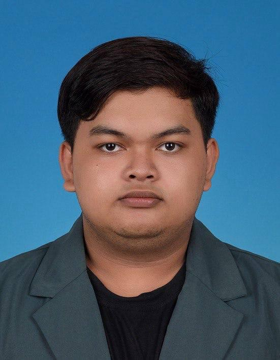

# Introduction
Hi! I'm Tengku Mohamad Haikal, a student in the **WIF3005 Software Maintenance and Evolution** course.  
I’m excited to learn about real-world practices in software maintenance, understanding how to manage, refactor, and evolve legacy systems efficiently. I also look forward to gaining hands-on experience with version control and collaborative maintenance workflows.

  <!-- Replace with your image path -->

## GitHub Profile

You can view my personalized GitHub profile [here](https://github.com/yourusername).

